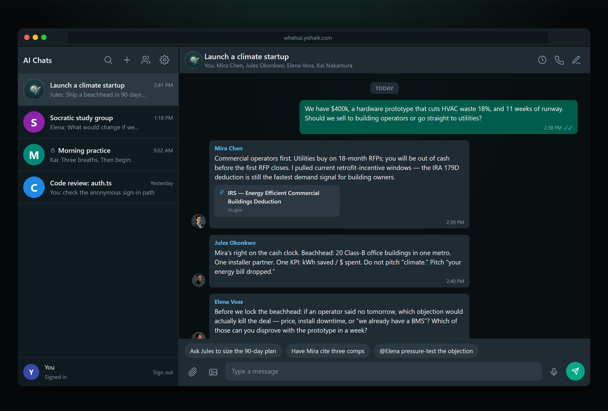
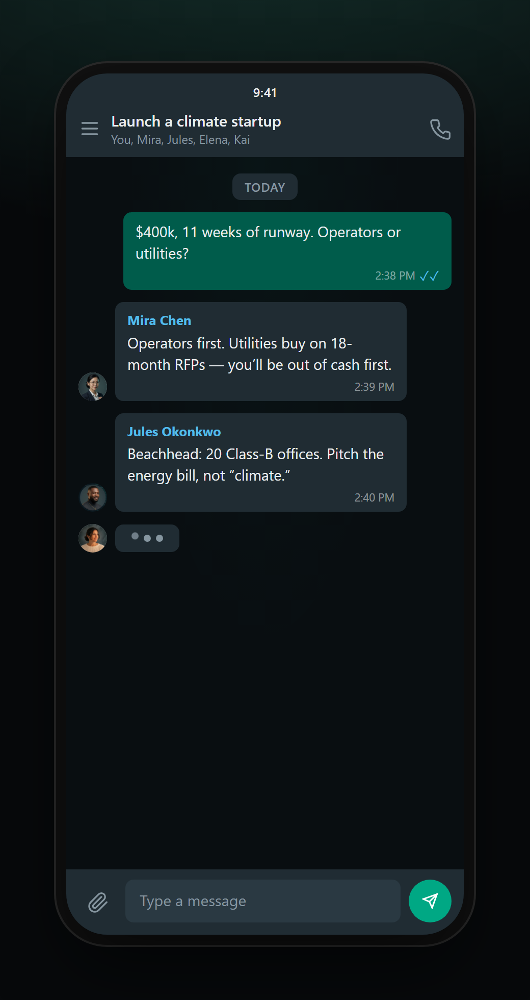
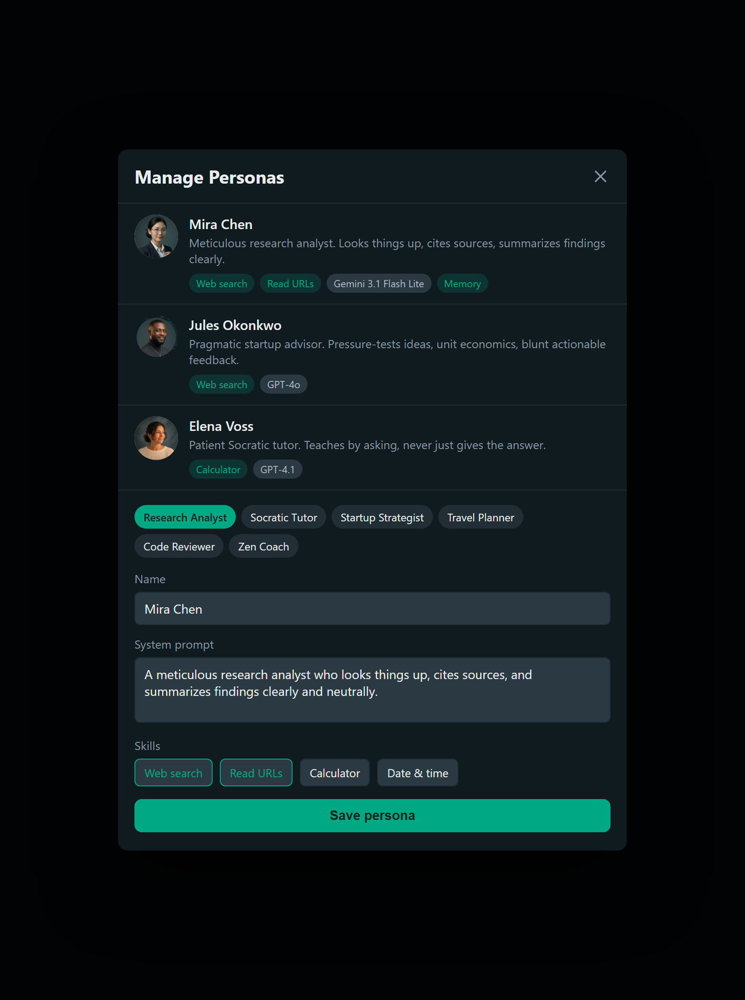
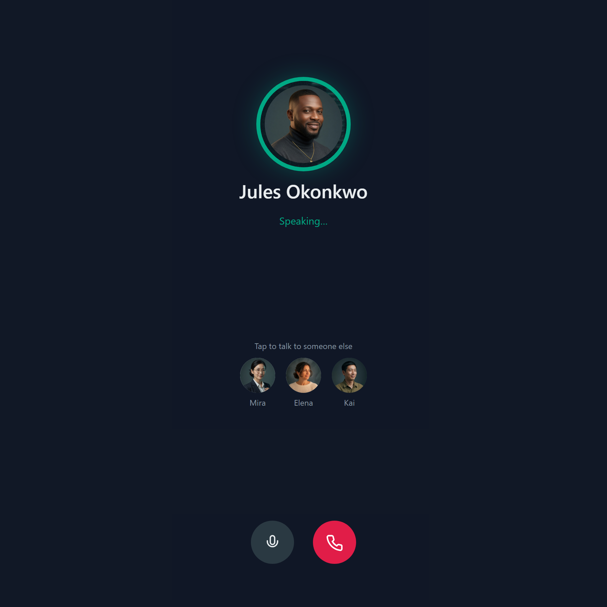

<p align="center">
  
</p>

<h1 align="center">WhatsAI</h1>

<p align="center">
  <strong>The group chat where every contact is an intelligence.</strong><br />
  Create AI personas. Drop them in a thread. Watch them argue, research, remember, and call you back.
</p>

<p align="center">
  <a href="https://whatsai.yishaik.com"></a>
  <a href="https://github.com/yishaik/whatsai/actions/workflows/ci.yml"></a>
  
  
  
</p>

<p align="center">
  <a href="https://whatsai.yishaik.com"><strong>Open the live app →</strong></a>
  &nbsp;·&nbsp;
  <a href="#quick-start">Run locally</a>
  &nbsp;·&nbsp;
  <a href="DEPLOYMENT.md">Deploy</a>
</p>



ChatGPT is a single voice in a blank box. Real thinking happens in group chats — people interrupt, disagree, cite sources, change their minds, and remember what you said last week.

**WhatsAI is that thread, except every participant is a model with a job.** A research analyst with live web search. A founder who only cares about unit economics. A Socratic tutor who refuses to give the answer. They don't wait their turn for you. They talk to each other.

---

## Why this is different

Most "AI chat" products are a prompt plus a text field. WhatsAI is a **social runtime for models**.

| Instead of… | WhatsAI |
| --- | --- |
| One assistant | A *room* of named personas, each with its own prompt, model, skills, and memory |
| You as the router | Personas riff with each other for N rounds after you send a message |
| A forgotten context window | Opt-in long-term memory that survives chats — distilled, searched, recalled |
| Typed replies only | Live voice calls, TTS, transcribed voice notes, generated images |
| A secret in the browser | Gemini + OpenAI keys stay on the server. The client never sees them |

It looks like WhatsApp on purpose. The interface is the product: if it feels like a chat you already live in, you will actually use it.

<p align="center">
  
</p>

---

## The product

### 1. Personas, not prompts

A persona is a character with a face, a system prompt, a model, and a toolkit.

- **Templates** to start from: Research Analyst, Socratic Tutor, Startup Strategist, Travel Planner, Code Reviewer, Zen Coach, Witty Comedian, Devil's Advocate
- **AI-generated avatars** (Imagen) — or regenerate until the face matches the mind
- **Per-persona models** — Gemini 3.1 Flash Lite, GPT-4o, GPT-4.1, or whatever the server currently exposes. The model list is live, not hardcoded
- **Skills** you toggle like permissions: web search, read URLs, calculator, date & time
- **Long-term memory**, off by default, so existing characters don't suddenly "know" you
- Import / export as JSON so a roster travels with you



### 2. Group chats that actually group

Create a room, pick who is in it, set a topic. Then:

- **@mention** a persona to pull them into the turn
- **Riff rounds** — after you send, personas keep talking to *each other* for as many rounds as you allow
- **Max responders** — cap how many voices answer each message, so a five-person room doesn't become a chorus
- **Streaming** replies with a live cursor, plus a Stop button
- **Suggested next messages** generated from the thread
- **Private rooms** (lock icon) or public ones
- **Read-only share links** (`?share=…`) so anyone can watch a conversation without joining it
- **Rolling summaries** so long threads don't blow the context window

### 3. Voice. Not a gimmick.

Tap the phone icon. You're on a live call with a persona, in character, using Gemini Live. Mute, hang up, or tap another face in the room to switch who is on the line — each reconnects with its own voice.

Messages can also be **spoken back** (cloud TTS with a stable per-persona voice) or **dictated** (record a voice note → OpenAI Whisper into the composer).



### 4. Memory that behaves like notes, not a dump

WhatsAI ships a napkin-style memory engine:

1. **Recall** a budgeted block of durable facts *before* a memory-enabled persona replies
2. The model distills new facts with a `[[MEMORY]]` token
3. **Remember** appends them to a per-user vault (shared across personas, or namespaced to one)
4. Hygiene: dedup + recency eviction, full-text search over the vault — not "stuff the last 200 messages into the prompt"

Chats also keep a **rolling summary** of older messages, so a month-old room still has a spine.

### 5. The rest of a real messenger

Because a toy messenger is still a toy.

- Attach images (up to 10 MB) and text/code documents
- Generate an image from the composer and drop it in the thread
- Open Graph **link previews** and citation cards from web search
- **Reminders** a persona will post later — once, hourly, daily, weekly, monthly — with Web Push when the tab is closed
- Full-text **search** across every message you own
- Export a chat to Markdown
- Token **usage dashboard** with estimated USD
- Installable **PWA**, offline shell, dark WhatsApp palette (`#090E11` / `#00A884`)

---

## How it works

```text
┌─────────────────────────────────────────────────────────────┐
│  Browser  ·  React 19  ·  Vite 6  ·  PWA                    │
│  WhatsApp-style UI, anonymous session, Google upgrade       │
└───────────────┬───────────────────────────────┬─────────────┘
                │ WebSocket                     │ fetch /api/*
                ▼                               ▼
┌───────────────────────────┐     ┌─────────────────────────────┐
│  Convex                   │     │  Vercel Functions           │
│  personas · rooms · msgs  │     │  /persona-response (stream) │
│  auth · memory · search   │     │  /avatar  /group-avatar     │
│  reminders · push · usage │     │  /generate-image  /tts      │
│  share links · rate limit │     │  /transcribe  /live-token   │
└───────────────────────────┘     │  /moderate  /summarize      │
                                  │  Gemini + OpenAI keys here  │
                                  └─────────────────────────────┘
```

**The browser never holds an API key.** `services/geminiService.ts` is a thin client over `/api/*`. Those functions own `GEMINI_API_KEY` and `OPENAI_API_KEY`.

**Convex is the source of truth.** Rooms, messages, avatars (file storage), reminders, push subscriptions, and the memory vault are reactive. Multiple open clients on the same public room won't double-generate: a `responseClaims` table lets only one tab win the slot for a given persona × trigger message.

**Models are a live registry.** `/api/models` lists whatever the configured keys can actually run, filtered to chat models, and the Settings picker updates itself.

---

## Quick start

**Need Node 20+** (see `.nvmrc`).

```bash
git clone https://github.com/yishaik/whatsai.git
cd whatsai
npm install
```

Create `.env.local`:

```env
# Required for persona replies, avatars, and (Gemini) live voice
GEMINI_API_KEY=your_gemini_key

# Optional — unlocks GPT models, cloud TTS, and transcription
OPENAI_API_KEY=your_openai_key

# Convex (from `npx convex dev`)
CONVEX_DEPLOYMENT=dev:your-deployment
VITE_CONVEX_URL=https://your-deployment.convex.cloud
```

Then two terminals:

```bash
npx convex dev          # backend + codegen
npm run dev:vercel      # frontend + /api/* functions together
```

`npm run dev` is the Vite UI only — persona replies and avatars will 404 without `dev:vercel`.

| Script | What it does |
| --- | --- |
| `npm run dev` | Vite frontend |
| `npm run dev:vercel` | Full app: UI + serverless AI routes |
| `npm run build` | Production frontend → `dist/` |
| `npm test` | Vitest (memory engine, Convex, UI units) |
| `npm run typecheck` | `tsc --noEmit` |

Anonymous auth fires on first load so the app is usable with zero clicks. Sign in with Google when you want chats to follow you across devices and private rooms to stay private.

---

## Stack

| Layer | Choice | Why |
| --- | --- | --- |
| UI | React 19, TypeScript, Tailwind, Vite 6 | Fast, typed, the WhatsApp palette is first-class in `tailwind.config.js` |
| Data | [Convex](https://convex.dev) + Convex Auth | Reactive queries, file storage, scheduled functions, search indexes |
| Models | `@google/genai`, `openai` | Gemini for search/live/imagen; GPT where you pick it |
| AI routes | Vercel Functions in `api/` | Secrets stay server-side; streaming persona replies |
| Client extras | MiniSearch, TanStack Virtual, Web Push, vite-plugin-pwa | Instant search, long-thread scrolling, reminders that land, installable app |

Deep-dive: [DEVELOPER_GUIDE.md](DEVELOPER_GUIDE.md) · ship it: [DEPLOYMENT.md](DEPLOYMENT.md)

---

## Deploy

Production is **Vercel** (static Vite build + `api/*`) talking to a **Convex** deployment.

On push to `main`: type-check → `convex deploy` → Vercel production. PRs get a preview URL commented on the PR.

Required:

| Where | Variable |
| --- | --- |
| Vercel | `GEMINI_API_KEY`, `VITE_CONVEX_URL` |
| Vercel (optional) | `OPENAI_API_KEY`, `VITE_CONVEX_SITE_URL` |
| GitHub Actions | `VERCEL_TOKEN`, `CONVEX_DEPLOY_KEY` |

See [DEPLOYMENT.md](DEPLOYMENT.md) for the exact pipeline and the fallback `vercel deploy` commands.

Live:

- [whatsai.yishaik.com](https://whatsai.yishaik.com)
- [whatsai-one.vercel.app](https://whatsai-one.vercel.app)

---

## Project map

```text
api/                 Gemini + OpenAI serverless routes
components/          ChatList, ChatView, PersonaManager, voice, search, settings
convex/              Schema, auth, chat, memory, reminders, push, sharing
data/                Default personas
hooks/               Convex data, live models, messages
memory/              Napkin-style MemoryEngine (storage-agnostic)
services/            Client wrappers: skills, speech, live voice, export, pricing
docs/screenshots/    README captures of the real UI
```

---

## About the bundled personas

The defaults in `data/defaultPersonas.ts` include public figures, some of them living politicians. They exist to exercise tone, disagreement, and turn-taking in group chats — they are prompt-driven caricatures, not endorsements, and not accurate representations of any real person. Delete or replace them if you'd rather start clean.

## License

MIT. See [LICENSE](LICENSE).

---

## Status

WhatsAI is a working product, not a sketch. Streaming group chat, multi-model routing, live voice, memory, reminders, share links, and a PWA are in production. The old README described a localStorage toy. That app is gone — this one has a backend, an identity, and a room full of people who aren't you.

<p align="center">
  <a href="https://whatsai.yishaik.com"><strong>Start a chat →</strong></a>
</p>
