# WhatsAI architecture

This is the source of truth for **how the running system works**. Product copy lives in [README.md](../README.md). How to run and ship lives in [DEVELOPER_GUIDE.md](../DEVELOPER_GUIDE.md) and [DEPLOYMENT.md](../DEPLOYMENT.md). Backend work should start from the facts here, not from filenames (`services/geminiService.ts` is not Gemini).

Walk through it in a browser: open **[how-it-works.html](how-it-works.html)** (sidebar + graphs).

Audited against the code on 2026-08-21.

---

## 1. What the system is

WhatsAI is a WhatsApp-style **multi-persona group chat**. Persistence, identity, and scheduling are **Convex**. LLM keys never leave **Vercel serverless functions**. Live voice is **not** on Vercel — Cloudflare hosts the default voice Worker; Gemini / OpenAI / Grok are minted server-side then connected from the browser.

The browser orchestrates a chat turn: it claims a reply slot, recalls memory, calls `/api/persona-response`, moderates, posts the message, and optionally riffs. Convex does not call the LLM.

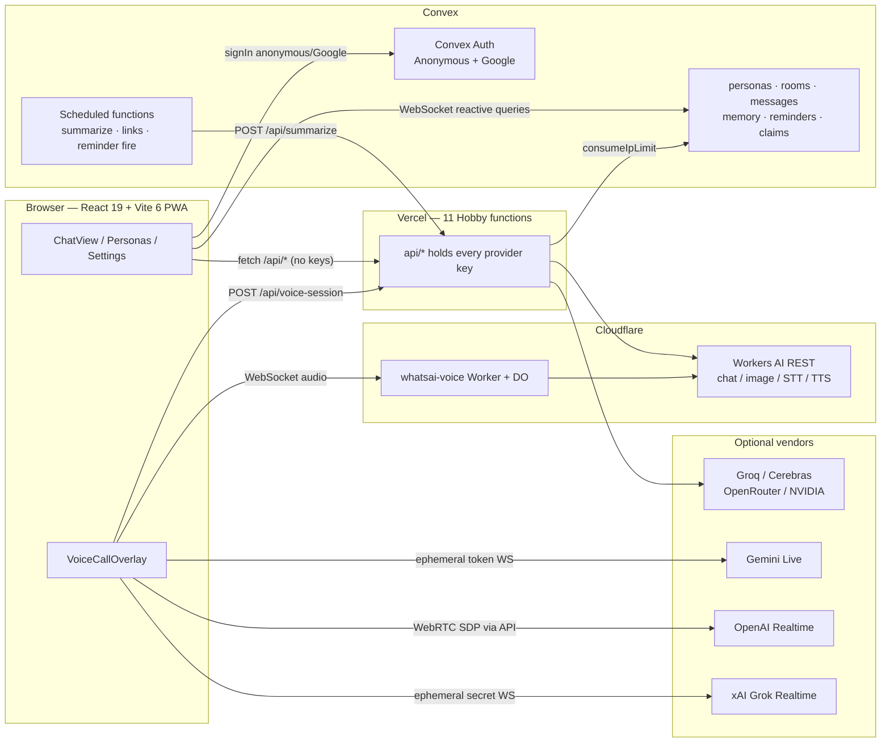

---

## 2. Trust boundary

| May hold secrets | Must not hold secrets |
| --- | --- |
| Vercel `process.env` (`api/*.ts`) | Anything `VITE_*` except Convex URLs |
| Convex env (`AUTH_GOOGLE_*`, `VAPID_*`, `CONVEX_DEPLOY_KEY`) | Browser bundles, localStorage, share links |
| GitHub Actions secrets (source of Vercel env via sync workflow) | `services/*` client code |
| Cloudflare Worker `AI` binding (no API token in the Worker source) | |

`VOICE_AGENT_HOST` is a public Worker URL, not a key. `XAI_API_KEY` is Grok voice; `GROQ_API_KEY` is Groq **chat**. They are different vendors.

---

## 3. Runtime pieces

### Browser

| Path | Role |
| --- | --- |
| `index.tsx` | `?share=` → `SharedChatView`; else `App` |
| `App.tsx` | Silent anonymous `signIn`, wires Convex hooks to UI |
| `components/ChatView.tsx` | Composer, reply loop, riff, voice note, suggestions, Stop |
| `components/VoiceCallOverlay.tsx` | Cloudflare vs Gemini/OpenAI/Grok |
| `hooks/useConvexData.ts` | Personas, rooms, settings, claims, memory, usage |
| `hooks/useChatMessages.ts` | Live messages for the open room |
| `hooks/useModels.ts` | Live `/api/models` list |
| `services/geminiService.ts` | **Misnomer.** Thin `fetch('/api/*')` client for chat + images |
| `services/{gemini,openai,grok}Live.ts` | Direct vendor voice sessions |
| `services/voice.ts` | Provider ids, per-persona voice pickers |

### Convex (`convex/`)

| File | Role |
| --- | --- |
| `schema.ts` | Tables below |
| `auth.ts` | Anonymous + Google |
| `http.ts` | Auth HTTP routes |
| `chat.ts` | Personas, rooms, messages, claims, rate limits, uploads |
| `personaMemory.ts` + `personaMemoryEngine.ts` | Long-term vault recall/remember |
| `memory.ts` | Rolling chat summary |
| `reminders.ts` | Schedule / fire persona messages |
| `push.ts` + `pushSubscriptions.ts` | Web Push for reminders |
| `links.ts` | Open Graph previews |
| `sharing.ts` | Read-only `?share=` links |
| `usage.ts` | Token totals |

### Vercel functions (`api/`) — 11 of 12 Hobby slots

Helpers **must not** live in `api/` (each file is a function). Shared code is `lib/*.js` because Vercel ESM cannot import sibling `.ts` (`includeFiles: "lib/**"` in `vercel.json`). `maxDuration` is 60s.

| Function | Called by | Does |
| --- | --- | --- |
| `persona-response.ts` | ChatView | Chat completion / SSE stream + tools |
| `models.ts` | Settings / pickers | Live model registry |
| `avatar.ts` | Persona create | Flux Schnell (CF) or Gemini image |
| `group-avatar.ts` | New room | Same, group prompt |
| `generate-image.ts` | Composer | User-requested image |
| `transcribe.ts` | Voice note | Whisper turbo (CF) or whisper-1 |
| `tts.ts` | Speak button | MeloTTS (CF) or OpenAI tts-1 |
| `suggest.ts` | ChatView idle | Next-message suggestions |
| `summarize.ts` | Convex `memory.maybeSummarize` | Rolling summary |
| `moderate.ts` | ChatView | OpenAI omni-moderation, **fails open** |
| `voice-session.ts` | Voice overlay | Rate-limit + mint / return Worker host |

### Cloudflare Voice Worker

- `worker/index.ts` + `wrangler.jsonc` → Worker name `whatsai-voice`
- Durable Object class `PersonaVoiceAgent` (`@cloudflare/voice` `withVoice(Agent)`)
- Binding: `AI`. Origins allowlisted (`ALLOWED_ORIGINS` + localhost + `*whatsai*.vercel.app`)
- Production: `https://whatsai-voice.yishai-k.workers.dev`

---

## 4. Data model

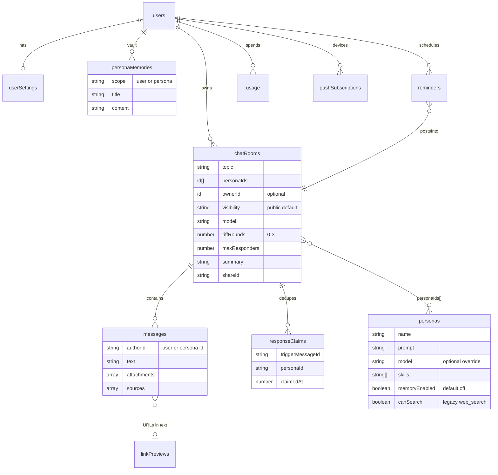

**Ownership as implemented (not as a product wish):**

- **Personas have no `ownerId`.** `getAllPersonas` / `createPersona` / `updatePersona` / `deletePersona` are global and unauthenticated. Any visitor’s anonymous session can mutate the shared roster. This is the largest backend gap.
- **Rooms:** `visibility` defaults to public. Public rooms are readable by everyone and **writable by any authenticated identity** (anonymous counts). Private rooms are owner-only. Legacy rows with no `ownerId` stay public.
- **Messages** `authorId` is `'user'` or a persona document id — not a Convex user id. The human speaker is not stored per message.
- **Memory vault** is per Convex user (`ownerId`), opt-in per persona (`memoryEnabled`).
- Avatars and attachments live in Convex file storage; `avatar` string is a legacy inline data URI.

---

## 5. Auth

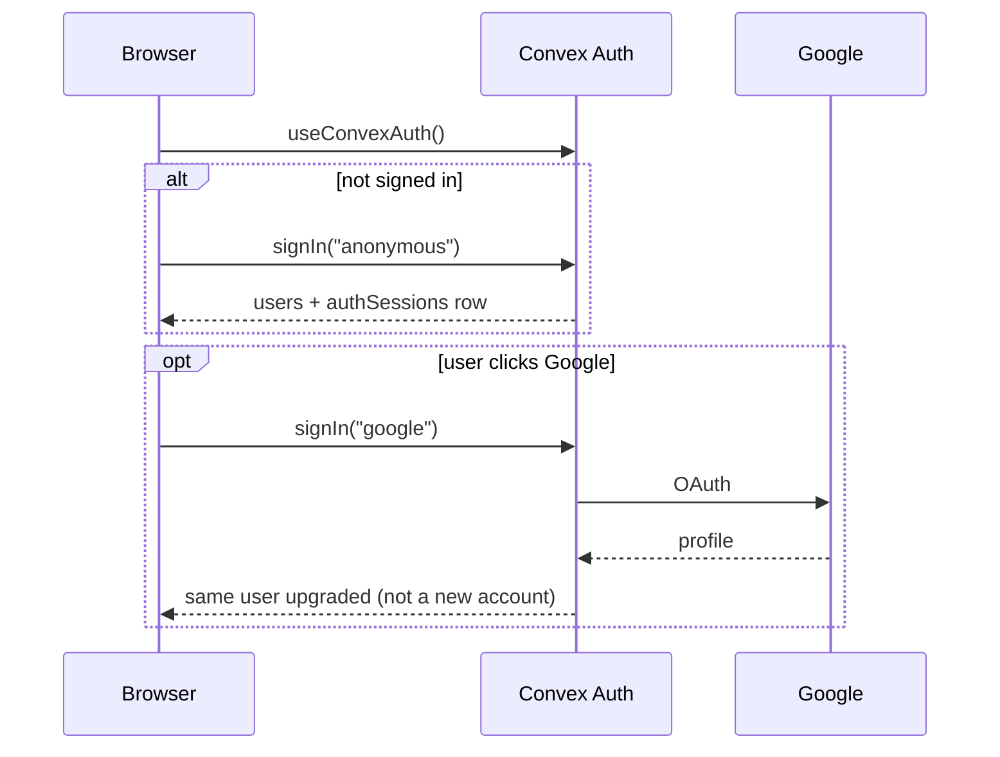

- Providers: `@convex-dev/auth` **Anonymous** + **Google** (`AUTH_GOOGLE_ID` / `AUTH_GOOGLE_SECRET` on the Convex deployment).
- Writes that check `getAuthUserId` fail without a session. That is why App signs in anonymously on first load.
- Google is an upgrade of the anonymous user, not a second identity — chats follow the account across devices.

---

## 6. A chat turn (text)

Generation is **client-orchestrated**. Convex only stores the result and serializes who may generate.

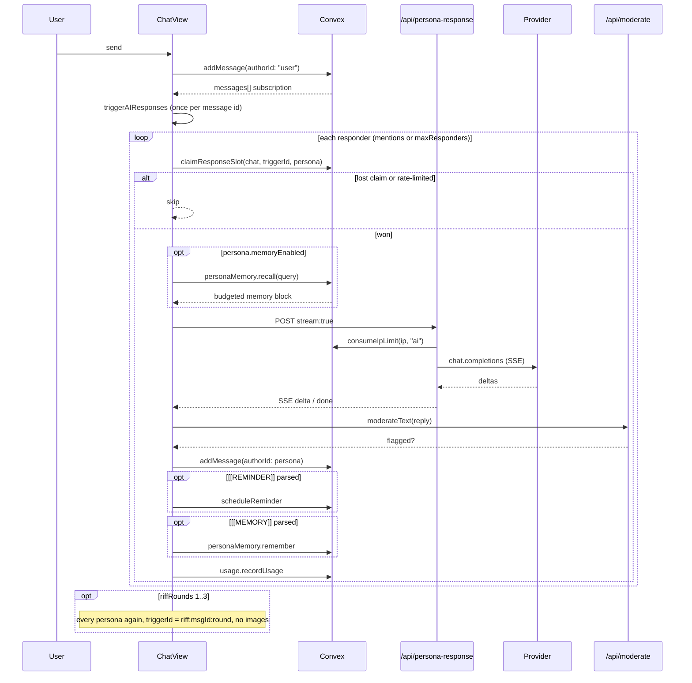

**Responder selection**

1. If the user text contains `@PersonaName`, only those personas reply (cap ignored).
2. Else `maxResponders` (chat setting) slices the participant list.
3. Else every persona in the room.

**Model fallback:** `persona.model` → `chatRoom.model` → `userSettings.defaultModel`.

**Dedup:** `responseClaims` is unique per `(triggerMessageId, personaId)`. Fresh claims last 90s; a stale claim can be stolen if a tab died. Public rooms with two open tabs would otherwise double-generate.

**Streaming:** SSE from `/api/persona-response`. `[[REMINDER]]` / `[[MEMORY]]` are stripped from the live cursor (`stripForDisplay`) and parsed after the stream ends (`finalizeReply`). If streaming throws a recoverable error, ChatView retries the non-streaming JSON path.

**Riff:** persona-authored messages do **not** re-enter `triggerAIResponses` (only `authorId === 'user'` does). Stop / a new user message aborts the in-flight `AbortController`.

**Long chats:** `addMessage` increments `messageCount`. After 200 messages, every 25th message schedules `memory.maybeSummarize`, which POSTs `/api/summarize` and stores `chatRooms.summary`. The next turn injects that summary as background. The client still only loads the newest 200 messages.

---

## 7. Model routing

The UI stores **one string** (`model`). Prefix decides the vendor. `/api/persona-response` strips the prefix before the HTTP call.

```mermaid
flowchart TD
  id["model id"] --> detect["lib/providers.js providerForModel"]
  detect -->|@cf/ or workers-ai/| CF["cloudflare — Workers AI OpenAI-compat"]
  detect -->|groq/| Groq["groq"]
  detect -->|cerebras/| Cerebras["cerebras"]
  detect -->|openrouter/| OpenR["openrouter"]
  detect -->|nvidia/| NV["nvidia"]
  detect -->|gpt- / o1 / chatgpt-| OAI["openai"]
  detect -->|else| Gem["gemini"]

  Gem -->|key missing and CF ready| Remap["remap to @cf/meta/llama-3.1-8b-instruct-fast"]
  OAI -->|key missing and CF ready| Remap
  Groq -.->|never remapped| Groq
```

Default chat model: `@cf/meta/llama-3.1-8b-instruct-fast`.

`/api/models` unions:

- Static Cloudflare catalog (`lib/cloudflareAi.js`)
- Static Groq / Cerebras / NVIDIA lists when those keys exist
- Live OpenRouter **free** (`pricing.prompt === "0"`) catalog
- Live Gemini / OpenAI lists only if those keys exist

Leftover Gemini/GPT ids remap onto Cloudflare when those keys are absent. Groq/Cerebras/OpenRouter/NVIDIA **never** remap — a missing key is a hard error.

---

## 8. Skills (tools)

Defined in `services/skills.ts`, executed in `api/persona-response.ts`.

| Skill | Mechanism | Who |
| --- | --- | --- |
| `web_search` | Native Google Search grounding | **Gemini only.** Ignored on Cloudflare / OpenAI-compat |
| `fetch_url` | Function tool; server `fetch`, HTML stripped, 2k chars, SSRF host block | All providers |
| `calculate` | Function tool; arithmetic `Function()` | All |
| `datetime` | Function tool; UTC now + user timezone | All |

If the persona has any function-tool skill, the turn is **buffered** (up to 3 tool rounds) and then emitted as one SSE delta — no token streaming. Tool failure falls back to plain generation.

In-band tokens (not tools), work on every provider:

- `[[REMINDER]]{"text","when","repeat"}` — client → `reminders.scheduleReminder`
- `[[MEMORY]]{"fact","topic"}` — client → `personaMemory.remember` (only if `memoryEnabled`)

---

## 9. Long-term memory

Napkin-style. The `memory/` package is storage-agnostic (unit-tested). Production binds it to Convex.

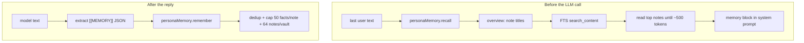

- Default **off** (`memoryEnabled` absent/false) so existing personas do not suddenly “know” the user.
- Scope default is `"user"`: one vault shared across that user’s personas. `"persona"` namespaces by `personaId`.
- Search uses Convex FTS (`personaMemories.search_content`), not an in-memory MiniSearch index on the hot path. MiniSearch remains in `memory/` for tests / the file-engine demo.

Rolling **chat** summary (`convex/memory.ts`) is a different system: it compresses old **messages**, not durable user facts.

---

## 10. Live voice

Settings store `userSettings.voiceProvider`: `cloudflare` | `gemini` | `openai` | `grok`. Default Cloudflare. Overlay can switch mid-call (reconnects).

GET `/api/voice-session` → `{ available, defaultProvider }`. POST is rate-limited (`consumeIpLimit` action `voice`) and never returns a long-lived vendor key.

### Cloudflare (default) — pipeline, not speech-to-speech

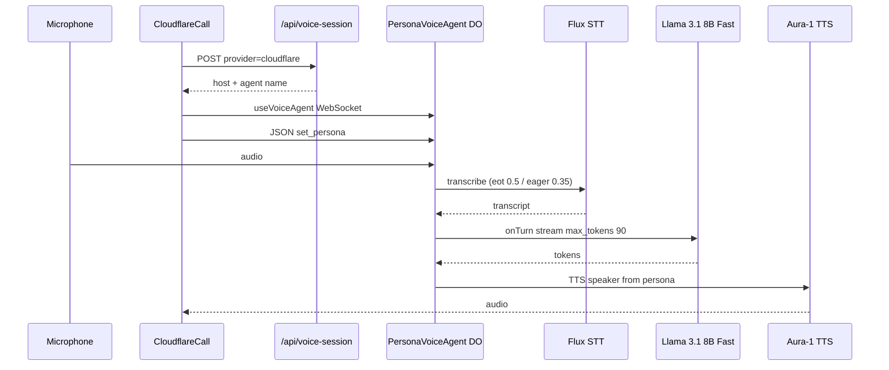

This is STT → short LLM turn → TTS. It will never feel like native duplex S2S. Interrupt is client-side (`silenceDurationMs: 280`, `interruptThreshold: 0.035`).

### Gemini Live — native audio

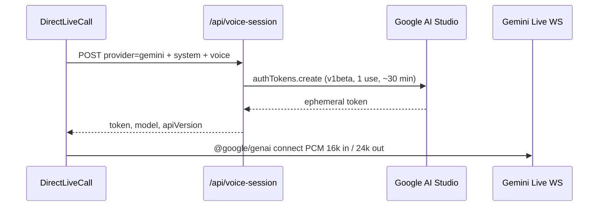

Model: `gemini-2.5-flash-native-audio-preview-12-2025` (fallback 09-2025 / v1alpha). Persona is baked into the token; switching faces reconnects.

### OpenAI Realtime — WebRTC, SDP proxied

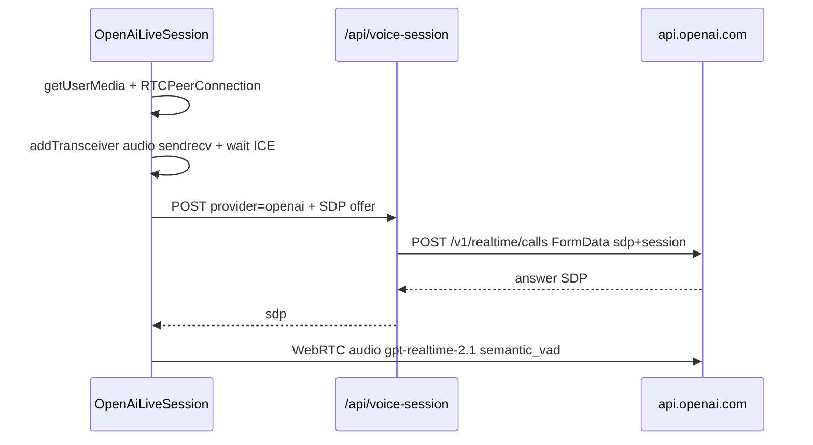

The browser cannot POST SDP to OpenAI (CORS). The function holds `OPENAI_API_KEY`.

### Grok — native S2S WebSocket

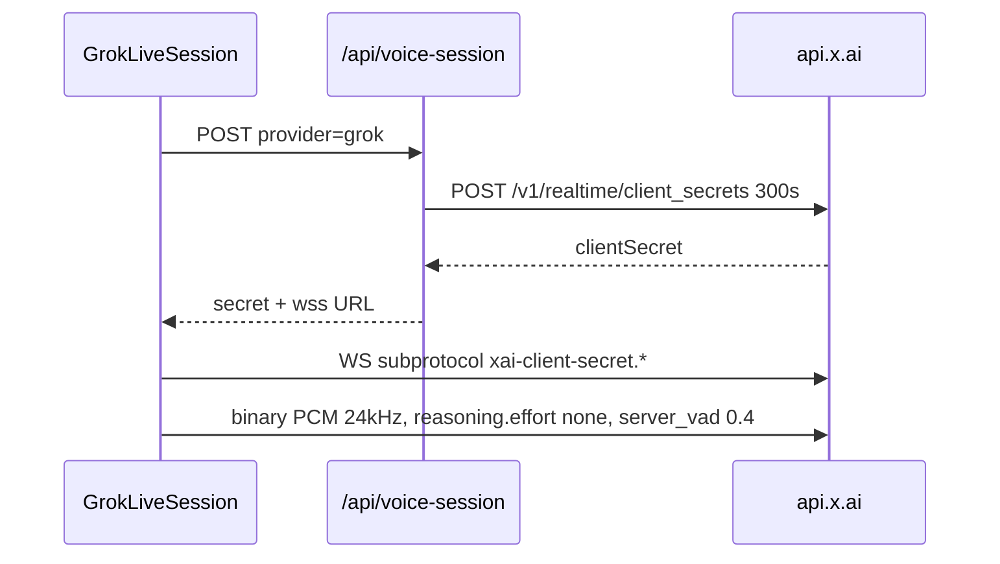

Uses `XAI_API_KEY`, not `GROQ_API_KEY`.

---

## 11. Other product paths

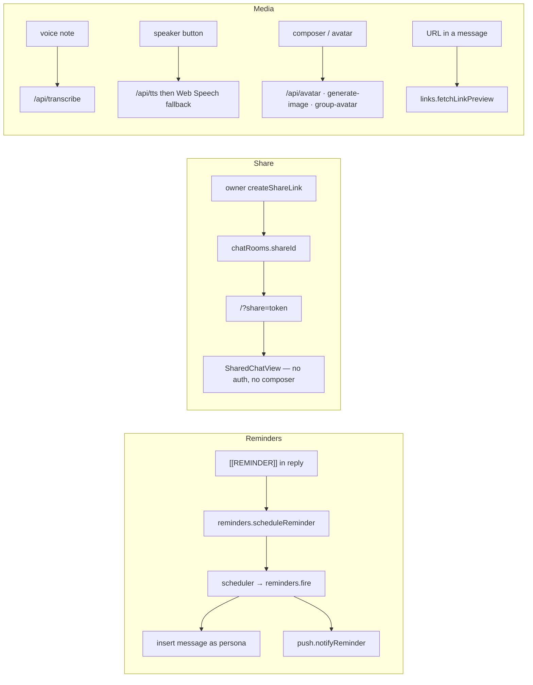

Push needs `VAPID_PUBLIC_KEY` / `VAPID_PRIVATE_KEY` on Convex; without them, fire still posts in-chat and push no-ops.

---

## 12. Rate limits

Convex table `rateLimits`, fixed windows.

| Key | Limit | Window | Where |
| --- | --- | --- | --- |
| `{userId}:sendMessage` | 20 | 1 min | `addMessage` |
| `{userId}:aiReply` | 100 | 1 min | `claimResponseSlot` (quiet skip) |
| `ip:{ip}:ai` | 80 | 1 min | `/api/persona-response` |
| `ip:{ip}:voice` | 20 | 1 min | `/api/voice-session` |
| `ip:{ip}:image` | 20 | 1 min | avatars / generate-image |
| plus moderate / summarize / suggest / transcribe / tts | see `chat.ts` | 1 min | matching functions |

IP limiter is a **public** mutation (`chat:consumeIpLimit`) so Vercel functions can call it without a user JWT. If Convex is unreachable, functions **fail open**.

---

## 13. CI/CD

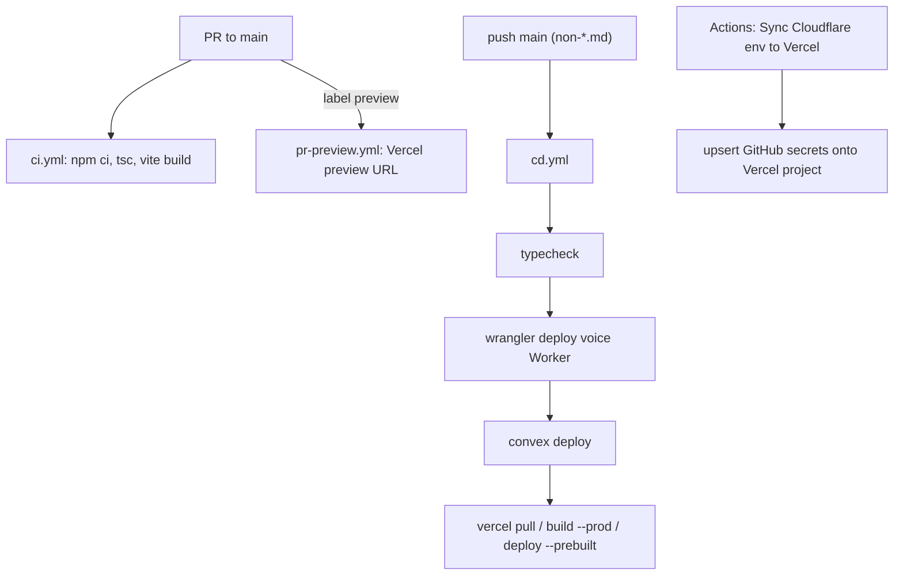

- Vercel git auto-deploy is **off** (`vercel.json` `git.deploymentEnabled: false`). Actions is the deployer.
- Node is `.nvmrc` **22** (Wrangler requires it).
- `ci.yml` typechecks and builds; it does **not** run `npm test`. `npm run verify` (typecheck + test + build) is the pre-merge gate locally.
- Docs-only pushes skip CD (`paths-ignore: **/*.md`, `docs/**`).

---

## 14. Local vs production

| Concern | Local | Production |
| --- | --- | --- |
| UI + `/api/*` | `npm run dev:vercel` | Vercel |
| Convex | `npx convex dev` | `npx convex deploy` in CD |
| Voice Worker | `npm run dev:voice` (`VOICE_AGENT_HOST=http://localhost:8787`) | `npx wrangler deploy` |
| Vite-only `npm run dev` | `/api/*` 404s | n/a |

Need **Node 22**. Copy `env.example` → `.env.local`. Never `VITE_*` for keys.

---

## 15. Constraints for backend work

These are verified facts, not a backlog of drive-by cleanups:

1. **Personas are a global mutable table.** No owner, no auth on CRUD. Backend work that “scopes data to a user” starts here.
2. **The LLM loop lives in the browser.** Convex does not generate replies. Moving generation server-side means replacing `ChatView.triggerAIResponses` + `claimResponseSlot`, not adding a second path.
3. **Hobby cap is 12 functions; 11 are used.** New `/api/*.ts` files require deleting or merging one. Helpers go in `lib/*.js`.
4. **`ipLimitOk` is copy-pasted** into every function because `api/` cannot import sibling `.ts`.
5. **`services/geminiService.ts` is the chat/image HTTP client**, leftover name from the Gemini era.
6. **`web_search` is Gemini-only.** Cloudflare personas should use `fetch_url`.
7. **Cloudflare voice is turn-based STT→LLM→TTS.** Do not document it as native live conversation.
8. **Public rooms + anonymous auth** mean any visitor can post in a public thread and trigger paid inference (mitigated by IP + user rate limits, not by ACL).
9. Messages store `authorId: "user"` — you cannot tell *which* human spoke once two people share a public room.

---

## 16. Repo map (after tidy)

```text
api/                 11 Vercel functions (keys live here)
lib/                 cloudflareAi.js, providers.js (plain JS for ESM)
worker/              Cloudflare Voice Agent + Durable Object
wrangler.jsonc       Worker name, AI binding, allowed origins
components/          UI (ChatView owns the reply loop)
convex/              schema, auth, chat, memory, reminders, push, sharing
hooks/               Convex + models (no localStorage)
memory/              storage-agnostic recall/distill/hygiene
services/            browser clients (geminiService = /api wrapper)
docs/ARCHITECTURE.md this file
docs/how-it-works.html interactive HTML walkthrough of these graphs
tests/               memory, models, voice, Convex personaMemory
.github/workflows/   ci, cd, pr-preview, sync-cloudflare-env
```

Deleted as leftover from the localStorage / Docker era: `App.tsx.backup`, `fix-storage.js`, `hooks/useLocalStorage*.ts`, `test-build.bat`, `test-build.sh`.
